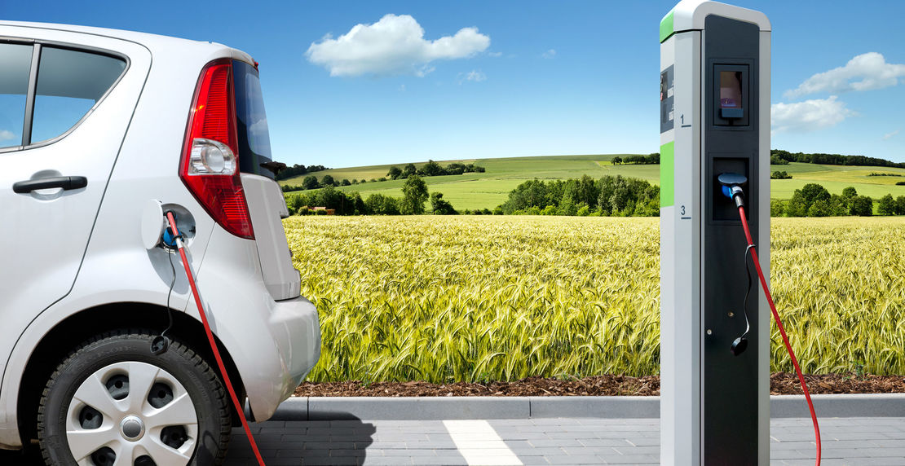

# Project 2: Shiny App Development Version 2.0



## U.S. Alternative Fuel Stations 
### App link: https://daniel-dh-lee.shinyapps.io/application/

+ ### Project background: 
Alternative fuels are any materials that can be used as fuels, other than conventional fuels. Common alternative fuels include Compressed Natural Gas, Electric, Hydrogen, and Liquefied Natural Gas. Currently, government and private-sector vehicle fleets are the primary users for most of these fuels and vehicles, but individual consumers are increasingly interested in them. Using alternative fuels and advanced vehicles instead of conventional fuels and vehicles helps the United States conserve fuel and lower vehicle emissions. 

Data source: 
- Alternative fuel stataions: https://afdc.energy.gov/data_download/alt_fuel_stations_format
- Conventional car data: https://afdc.energy.gov/laws/11847

+ ### Web Application summary: 
This Application privides two main goals.

1. This Alternative Fuel Calculator Web Application helps eco-friendly drivers find nearby alternative fuel stations and calculate the estimated price of alternative fuels they need to get to their destinations.
- Interactive Map: Find nearby alternative fuel stations in the map
- Calculator: Calculate estimated price the type and size of your fuel
- Navigator: Display distance and time between the origin and destination

2. This app also contains an analytics report that shows some preliminary data analysis results to help people learn more about how alternative fuel is adapted in the U.S. 
- Fuel type by State
- Animation of the growth of alternative fuel
- Access type by fuel type


Term: Spring 2019

+ Team sec1-grp8
+ **Team members**: 
	+ Daniel Lee dl3250@columbia.edu
	+ Rui Cao rc3208@columbia.edu
	+ Suzy Gao zg2333@columbia.edu
	+ Yiwen Ma ym2775@tc.columbia.edu
	+ Yuting Gong yg2641@columbia.edu


+ **Contribution statement**:<br>


+ Daniel Lee:
- Contructed the backbone of the application (structured UI and Server)
- Integrated Google Maps API into the interactive map (navigation, direction, geocode)
- Integrated animation of Leaflet map

+ Rui Cao:
- Contributed to the UI design
- Data visualization,deployed interactive map using Leaflet package
- Presentor 


+ Suzy Gao:
- Organized project structure and workflows, conducted research on UI design
- Arranged project github page, wrote summary and project description in readme files
- Data visualization, created analytics graphs(bar chats)


+ Yiwen Ma:
- Deployed introduction page and contribute to the UI design
- Conducted function in the calculator tools
- Data visualization, made analytics plots


+ Yuting:
- Data visualization, plotted graphs using plotly for analytics page
- Conducted research on UI design
- Contributed to the introduction page and wrote introduction texts
- Arranged project github, organized sub-folders and wrote project readme files


Following [suggestions](http://nicercode.github.io/blog/2013-04-05-projects/) by [RICH FITZJOHN](http://nicercode.github.io/about/#Team) (@richfitz). This folder is orgarnized as follows.

```
proj/
├── app/
├── lib/
├── data/
├── doc/
└── output/
```

Please see each subfolder for a README file.

