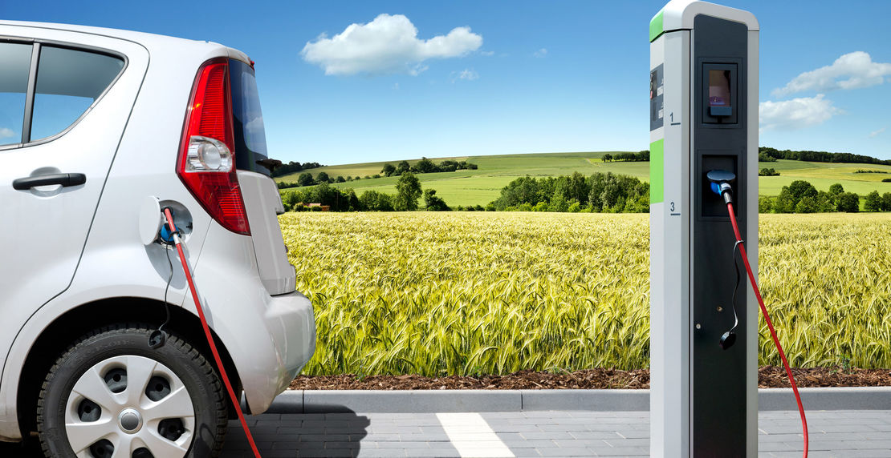

# Project 2: Shiny App Development Version 2.0



## U.S.Alternative Fuel Stations 
Term: Spring 2019

+ Team sec1-grp8
+ **Team members**: 
	+ Daniel Lee
	+ Rui Cao
	+ Suzy Gao
	+ Evelyn
	+ Yuting

+ **Project summary**: 
This Application privides two main goals.
1. Help user to find the nearby stations for alternative fuel.
2. Provide a analytics dashborad to show trend and distribution of Alternative Fuel in the U.S..

+ **Contribution statement**: ([default](doc/a_note_on_contributions.md)) All team members contributed equally in all stages of this project. All team members approve our work presented in this GitHub repository including this contributions statement. 

Following [suggestions](http://nicercode.github.io/blog/2013-04-05-projects/) by [RICH FITZJOHN](http://nicercode.github.io/about/#Team) (@richfitz). This folder is orgarnized as follows.

```
proj/
├── app/
├── lib/
├── data/
├── doc/
└── output/
```

Please see each subfolder for a README file.

